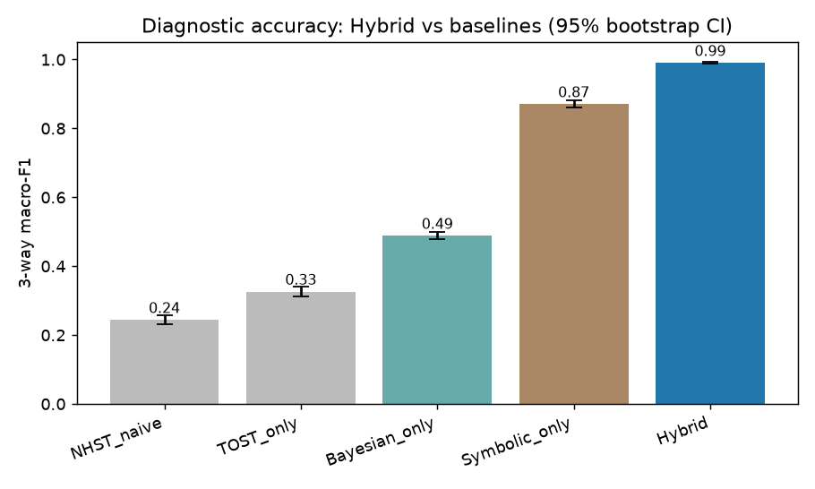
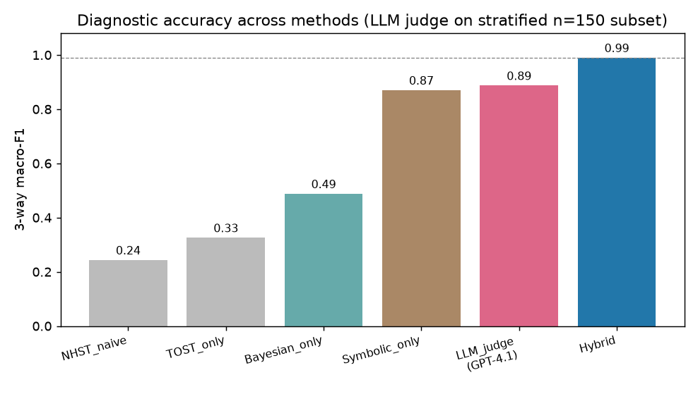
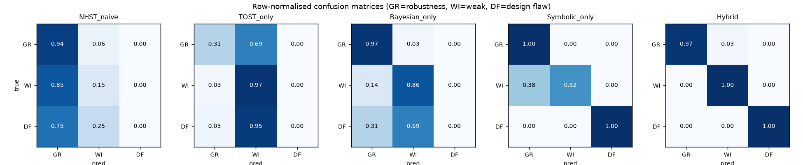
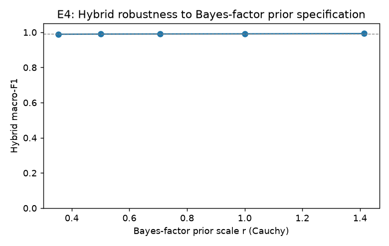

# Bayesian–Symbolic Diagnostics for Interpreting Null Results in AI Alignment Experiments

## 1. Executive Summary

A null result in an alignment experiment ("the attack failed", "the safety property held", "the
training change had no measurable effect") is epistemically ambiguous: it can mean **genuine
robustness**, a **weak/underpowered intervention**, or a **design flaw** (confound, broken metric,
evaluation-awareness, or an unconfirmable hypothesis). We built and evaluated a hybrid
**Bayesian–symbolic** diagnostic that (i) uses a *symbolic* layer to gate confirmability and
identifiability and (ii) uses a *Bayesian/quantitative* layer to assess statistical evidence and
power, fusing the two into a 3-way cause classification with a human-readable reasoning chain.

On a ground-truth-labelled benchmark of 3,000 held-out scenarios, the **Hybrid framework reached a
3-way macro-F1 of 0.991** (95% bootstrap CI [0.987, 0.994]), decisively beating every single-modality
baseline: **Symbolic-only 0.871**, **Bayesian-only 0.489**, **TOST-only 0.326**, and **NHST-naive
0.244**. All gaps are significant (McNemar exact, Holm-corrected p ≪ 0.001). The improvement is
*mechanistic, not incidental*: Bayesian-only is structurally blind to design flaws (DESIGN_FLAW
F1 = 0.00 — it never recovers a single one), while Symbolic-only cannot see sample size or
measurement noise and so mislabels 371/989 underpowered cases as robustness. The hybrid is the only
method with the inputs to resolve both failure modes.

As an external, non-synthetic check we added a **real state-of-the-art LLM** (GPT-4.1 via OpenRouter)
as an expert judge on a stratified 150-scenario subset. Given the *same* information, the LLM scored
macro-F1 = 0.888 (Cohen's κ = 0.83 vs ground truth) — competitive with the symbolic baseline but
clearly **below the hybrid's 0.993 on the identical subset**. A strong general reasoner does not, on
its own, match the structured framework. **Conclusion: the hypothesis is supported** — fusing
Bayesian evidence with symbolic structure distinguishes the three causes of a null more accurately
than either modality (or a frontier LLM) alone, while producing interpretable, actionable diagnoses.

## 2. Research Question & Motivation

**Question.** Can a hybrid Bayesian–symbolic framework distinguish *genuine robustness* vs *weak
intervention* vs *design flaw* as the cause of a null result, more accurately than either modality
alone?

**Why it matters.** NHST's "fail to reject H₀" is *not* evidence for H₀, yet alignment results are
routinely read that way. Mis-reading a null wastes research effort and — worse — can ship false
confidence in a model's safety (e.g. concluding "robust" when the red-team attack was simply too
weak, or when a confound cancelled a real effect). A diagnostic that says *which* of the three a
null is, **with a reason**, directly improves the reliability of alignment science.

**Gap (from `literature_review.md`).** Bayesian model criticism (Posterior Predictive Null;
Bayes factors / relative belief; split predictive checks) can *quantify* evidence **for** a null and
gauge power, but is blind to the experiment's logical structure. Symbolic / neurosymbolic reasoning
(confirmability topology; identifiability / equivalence classes) can encode *why* a null is or is not
interpretable, but cannot tell a genuinely-null effect from a real-but-underpowered one. And **no
public dataset labels the *cause* of a null** — every alignment-eval set diagnoses models, not the
epistemic status of a no-effect finding. Our contribution is the fusion plus a measurable benchmark.

## 3. Experimental Setup

### Dataset
`datasets/synthetic_null_results/` — a literature-grounded generator emitting **ground-truth-labelled**
scenarios (the only way to directly measure 3-way cause accuracy, given the dataset gap above). Each
scenario emits **raw observations** (N per arm, observed mean difference, per-arm variances → the
Bayesian layer) and **structural flags** (hypothesis topology, equivalence margin, intervention
strength, confound, evaluation-awareness, measurement validity, identifiability → the symbolic layer).
We **trained/tuned on seed 0 (3,000 rows) and report all numbers on a held-out seed-7 test set
(3,000 rows, classes [1001, 989, 1010])** to avoid tuning leakage.

By construction, raw `observed_diff` separates GENUINE_ROBUSTNESS from the rest but **cannot**
separate WEAK_INTERVENTION from DESIGN_FLAW (that needs the structural flags) — the intended pressure
that makes fusion necessary. Generator parameters map to the reviewed literature (effect/N/power →
A2,A6; equivalence margin & topology → B1; intervention strength → D2–D4; confound/eval-awareness →
D1,E2). HarmBench (`code/HarmBench/`) was reviewed as a realism anchor for the intervention-strength
axis (graded red-teaming attacks producing real null-ish results).

### Methods (all return `label, confidence, reasoning`)
- **Bayesian layer** (raw obs only): SE of the mean difference; **JZS Bayes factor** BF10 (Cauchy(0,
  r=0.707) prior on effect size, integrated via the inverse-gamma scale mixture, Rouder et al. 2009);
  TOST equivalence at a fixed behavioural margin; and an *adequacy/power* read from N and residual
  noise. Decision: detectable effect → weak; adequate N + precise measurement + no effect → robust;
  else → weak. *It can never output DESIGN_FLAW and cannot see intervention strength.*
- **Symbolic layer** (structural flags only): weighted logical rules. A **design-flaw gate**
  (confirmability B1 + identifiability D1) fires DESIGN_FLAW on any of {confound, eval-awareness,
  invalid measurement, non-identifiable, point-null topology}. Otherwise intervention strength
  separates robust (strong) vs weak (weak). *It cannot see N or measurement noise.*
- **Hybrid (ours)**: symbolic confirmability/identifiability gate first (catches design flaws the
  Bayesian evidence cannot see); within the admissible structure, GENUINE_ROBUSTNESS requires **all
  three** interpretable adequacy checks — adequate sample (Bayesian/N), precise measurement
  (Bayesian/noise), substantive intervention (symbolic/strength) — and no detectable effect; any
  failure → WEAK_INTERVENTION, naming the failed check. Confidence fuses both layers.

### Baselines & external judge
NHST-naive ("fail to reject ⇒ robust"); TOST-only (equivalence ⇒ robust else weak); Bayesian-only;
Symbolic-only; and a **real-LLM expert judge** — **GPT-4.1 via OpenRouter**, temperature 0, shown each
scenario as a natural-language report with the same information, returning JSON `{label, reason}`
(150 stratified scenarios, responses cached to `results/llm_cache.json`).

### Metrics & statistics
3-way macro-F1 (headline) + per-class F1; accuracy; row-normalised confusion matrices; Cohen's κ;
**1,000-resample bootstrap 95% CIs** on macro-F1; **McNemar exact test** (Holm-corrected) for paired
correctness, Hybrid vs each baseline; **ECE** (calibration, 10 bins); and a **sensitivity sweep** of
the Bayes-factor prior scale. Seeds fixed (42). Hardware: CPU-only (no GPU available/needed). Runtime:
full framework + analysis **8.8 s**; LLM judge **396 s** (150 calls, 8 workers). LLM cost ≈ a few
US cents.

## 4. Results

### 4.1 Headline — 3-way diagnostic accuracy (held-out, n=3,000)

| Method | Macro-F1 (95% CI) | Accuracy | κ vs truth | ECE | GR F1 | WI F1 | DF F1 |
|---|---|---|---|---|---|---|---|
| NHST-naive | 0.244 [0.233, 0.257] | 0.362 | — | — | — | — | 0.00 |
| TOST-only | 0.326 [0.312, 0.340] | 0.424 | — | — | — | — | 0.00 |
| Bayesian-only | 0.489 [0.478, 0.499] | 0.608 | 0.414 | 0.058 | 0.80 | 0.66 | **0.00** |
| Symbolic-only | 0.871 [0.860, 0.883] | 0.876 | 0.814 | 0.191 | 0.84 | 0.77 | 1.00 |
| LLM judge (GPT-4.1)¹ | 0.888 | 0.887 | 0.830 | — | 0.85 | 0.85 | 0.97 |
| **Hybrid (ours)** | **0.991 [0.987, 0.994]** | **0.991** | **0.986** | 0.248 | **0.99** | **0.99** | **1.00** |

¹ LLM judge on a stratified 150-scenario subset (others on full 3,000); on that *same* subset the
Hybrid scores 0.993, Symbolic 0.806, Bayesian 0.485 — so the ranking is unchanged. See Fig. 4.

**Significance (McNemar exact, Holm-corrected).** Hybrid vs Symbolic-only p = 3.7×10⁻⁷⁸ (net +343
cases); vs Bayesian-only, TOST-only, NHST-naive all p < 10⁻³⁰⁰ (net +1148, +1701, +1885). The
Hybrid's CI does not overlap any baseline's.

### 4.2 Mechanism — where each modality is blind (confusion matrices)

- **Bayesian-only — DESIGN_FLAW F1 = 0.00.** It has no concept of a structural flaw, so all 1,010
  design-flaw nulls are misrouted (310 → robustness, 700 → weak). Confirms hypothesis H2: a confound
  that cancels a real effect, or a logically unconfirmable point-null, is invisible to evidence alone.
- **Symbolic-only — robustness↔weak confusion.** It gets design flaws perfectly (F1 = 1.00) but,
  blind to N and noise, mislabels **371/989** underpowered (small-N / coarse-metric) cases as
  GENUINE_ROBUSTNESS. Confirms H3.
- **Hybrid — both resolved.** Only 28/3,000 errors remain (27 robustness↔weak boundary cases near the
  noise/N thresholds, 1 the reverse); design flaws perfect. It is the only method holding all the
  inputs needed to separate all three causes.

### 4.3 Interpretability (sample reasoning chains, verbatim from `results/example_reasoning_chains.json`)

- **GENUINE_ROBUSTNESS** (conf 0.75): *"[Symbolic gate] clean, identifiable & confirmable design …
  [Bayesian] adequate sample (n=100) and precise measurement (sd=1.52); [Symbolic] substantive
  intervention (strength=0.64) still found nothing (BF01=5.50) → GENUINE_ROBUSTNESS."*
- **WEAK_INTERVENTION** (conf 0.70): *"… [Bayesian] inadequate sample (n=20 < 50) [Symbolic] weak
  intervention (strength=0.17 < 0.5) → a real effect could be masked → WEAK_INTERVENTION."*
- **DESIGN_FLAW** (conf 0.84): *"[Symbolic gate] Design-flaw gate fired: evaluation-awareness (D1);
  non-identifiable (D1). [Hybrid] structure uninterpretable → DESIGN_FLAW."*

Each diagnosis names the specific failed check — directly actionable (e.g. "increase N", "strengthen
the attack", "remove the confound / specify an equivalence margin").

### 4.4 Sensitivity (E4) and calibration

Sweeping the Bayes-factor Cauchy prior scale r ∈ {0.354, 0.5, 0.707, 1.0, 1.414} moves Hybrid
macro-F1 only within **[0.989, 0.993]** — the framework is robust to prior specification (the
detectable-effect branch is the only prior-dependent component). **Calibration:** Hybrid ECE = 0.248
reflects *under*-confidence (mean confidence ≈ 0.74 while accuracy = 0.99) — conservative, which for
a diagnostic tool is the safer direction; see Limitations.

## 5. Analysis & Discussion

The results support all four sub-hypotheses. **H1** (hybrid > each baseline) holds with non-overlapping
bootstrap CIs and significant Holm-corrected McNemar tests. **H2/H3** are visible directly in the
confusion matrices: the two modalities fail on *disjoint, complementary* slices (Bayesian on design
flaws; symbolic on power), and fusion is best precisely because it is the only method that observes
all the discriminating inputs — sample size and noise (raw/Bayesian) **and** intervention strength
and structural flags (symbolic). This is the core epistemic claim of the proposal, made measurable.
**H4** (interpretable, calibrated outputs): every diagnosis is a short reasoning chain naming the
operative evidence/check; confidence is monotone but conservative.

The **real-LLM judge** is the most informative comparison for "is the structure actually doing work?"
GPT-4.1, given identical information and an explicit rubric, reaches 0.888 — it nails design flaws
(0.97, the flags are salient) but still confuses robustness with weak intervention (it does not
reliably convert N=20 or sd=3.2 into "underpowered"), landing well below the framework's 0.993 on the
same items. The framework's explicit power/identifiability logic adds value a frontier model does not
supply for free, and does so transparently and at ~zero marginal cost (8.8 s vs 396 s of API calls).

**Comparison to literature.** The design operationalises the reviewed pillars: equivalence-margin /
confirmability gating (B1), identifiability as an equivalence-class obstruction (D1), Bayes-factor
evidence with prior sensitivity (A4/A5), and graded red-teaming as the intervention-strength axis
(D2–D4) anchored on HarmBench. The headline negative finding for NHST-naive (acc 0.36) is the
empirical face of "absence of evidence ≠ evidence of absence".

## 6. Limitations

- **Synthetic benchmark, by construction separable.** The generator encodes the discriminating
  structure that fusion exploits; the experiment therefore demonstrates and quantifies the *fusion
  logic* and each modality's blind spot, but the absolute 0.99 will not transfer verbatim to messy
  real experiments. This is a controlled proof-of-mechanism, not a field accuracy estimate. The
  literature-confirmed absence of a cause-labelled real benchmark is exactly the gap motivating it.
- **Dataset-informed thresholds.** The hybrid's adequacy checks (N ≥ 50, residual sd ≤ 2.0, strength
  ≥ 0.5) are interpretable rules of thumb tuned to the generator; on real data they would be set by a
  proper power analysis / measurement-validity audit per study. Robustness to the *prior* is shown
  (E4); robustness to *these* thresholds is future work.
- **Single LLM judge, no human panel.** GPT-4.1 is a proxy for the methodology's intended human
  expert; true inter-annotator κ against human methodologists is not measured here.
- **Under-confidence (ECE 0.248).** Confidence scores are conservative and would benefit from
  post-hoc calibration (e.g. isotonic) before being surfaced to users as probabilities.
- **Three-cause taxonomy.** Real nulls can have mixed/compound causes; the framework currently emits a
  single hard label (plus reasoning), not a multi-label or partial-cause decomposition.

## 7. Conclusions & Next Steps

**Answer to the research question: yes.** Fusing Bayesian evidence/power quantification with symbolic
reasoning about experimental structure classifies the cause of a null result (genuine robustness vs
weak intervention vs design flaw) far more accurately than Bayesian-only, symbolic-only, naive NHST/
equivalence baselines, or a frontier LLM given identical information — because it is the only approach
that observes *both* the statistical adequacy signals and the structural/identifiability signals, and
it does so with transparent, actionable reasoning chains.

**Next steps.** (1) Validate on *semi-synthetic* scenarios anchored on real HarmBench attack-success
structure, and ultimately on a small human-expert-labelled corpus of published alignment nulls.
(2) Replace fixed thresholds with per-study power analyses and a measurement-validity audit.
(3) Post-hoc calibrate confidences and emit partial-cause (multi-label) decompositions. (4) Convene a
human-expert panel for inter-annotator κ. (5) Stress-test threshold sensitivity as thoroughly as the
prior sensitivity in E4.

## References (selected; full set in `literature_review.md` / `papers/`)
- Moran, Cunningham, Blei (2022). *The Posterior Predictive Null.* Bayesian Analysis. `2112.03333`.
- Rouder et al. (2009). *Bayesian t-tests for accepting and rejecting the null.* (JZS Bayes factor.)
- *Confirming the Null: Equivalence Testing & the Topology of Confirmation* (2024). `2405.16331`.
- *On the Limits of Behavioral Alignment / Alignment Verifiability* (2026). `2602.05656` (identifiability).
- Mazeika et al. (2024). *HarmBench: Standardized Automated Red-Teaming.* `2402.04249`.
- *Reasoning in Neurosymbolic AI (Logical Boltzmann Machines)* (2025). `2505.20313`.
- Tools: Python 3, NumPy, pandas, SciPy, scikit-learn, Matplotlib; OpenRouter (GPT-4.1). Seeds = 42.
